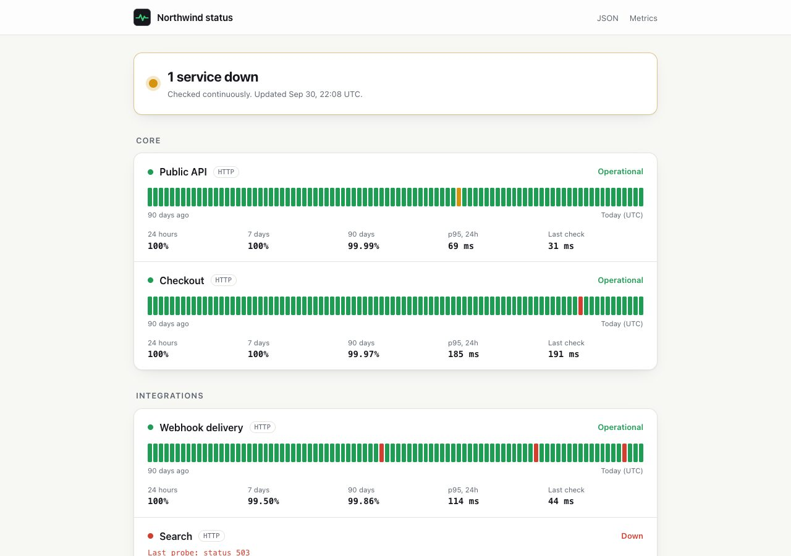
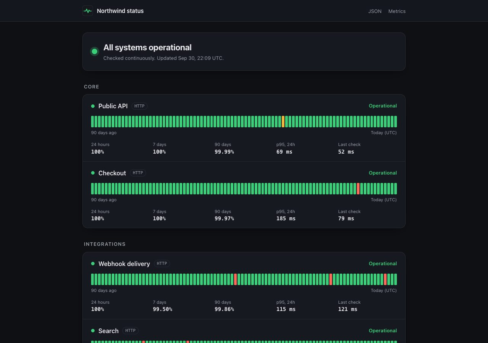
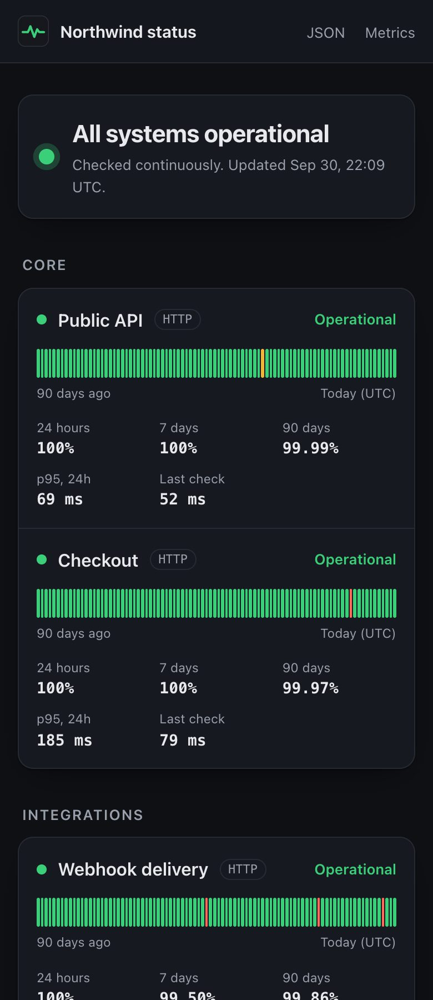

<p align="center">
  
</p>

<h1 align="center">Pulse</h1>

<p align="center">
  Uptime checks and a public status page, in one binary.<br>
  <sub>Go · standard library first · pure-Go SQLite · Prometheus metrics · ECS Fargate</sub>
</p>

<br>

Checking a pulse is the quickest way to know something is alive, and that is
all Pulse does, on a schedule. Point it at a YAML file; it probes each target
on an interval, opens an incident when something stays down, tells a webhook
or a Slack channel, and serves a status page with ninety days of history. One
static binary and one SQLite file, no cgo, no JavaScript framework.

The interesting parts are the ones easy to get subtly wrong: scheduling many
probes without bunching, deciding when a failure is an outage, and an uptime
figure that means what it says.



<p align="center">
  
  
</p>

## Running it

You need Go 1.26 or newer. Nothing else: no database server, no Docker.

1. Clone and start the demo, from the repo root:

   ```bash
   git clone https://github.com/Brunoskyy/pulse.git && cd pulse
   go run ./cmd/pulse demo
   ```

2. Open http://127.0.0.1:8080. The demo runs four fake services on loopback,
   fills ninety days of history with a few scripted outages, and checks them
   every five seconds.

3. In a second terminal, take a service down with the `curl -X POST .../down/search`
   command the demo printed. About ten seconds later an incident opens; run
   the same command with `/up/` instead of `/down/` and it closes ten seconds after.

Stop with Ctrl+C. The demo keeps its database in a temporary folder that is
deleted on exit, so every run starts fresh.

For real checks, from the repo root:

```bash
cp examples/pulse.yaml pulse.yaml   # edit the checks; set database: pulse.db to keep it local
go build -o pulse ./cmd/pulse
./pulse check -config pulse.yaml    # validate and exit
./pulse run -config pulse.yaml      # status page on :8080
```

The example writes to `/data/pulse.db`, the container's path, so change it
first. Its notifiers read `PULSE_WEBHOOK_SECRET` and `SLACK_WEBHOOK_URL`, and
Pulse refuses to start until those are set, so export them or delete the
`notifiers` block. Delete the database file to reset the history.

| Path | |
| --- | --- |
| `/` | the status page |
| `/api/status` | the same data as JSON |
| `/api/incidents` | incidents in the last ninety days |
| `/metrics` | Prometheus text format |
| `/healthz` | liveness |

| Command (repo root) | |
| --- | --- |
| `go test -race ./...` | 63 tests (71 with subtests) |
| `go test -run xxx -bench . ./internal/pool` | the worker pool benchmark |

## Configuration

Everything except `checks` has a default, and unknown keys are an error, with
every problem in the file reported at once.

```yaml
title: Northwind status
listen: ":8080"
database: /data/pulse.db
retention: 2160h        # 90 days

checks:
  - name: Public API
    group: Core
    kind: http          # http, tcp, dns or tls
    target: https://api.example.com/health
    interval: 30s
    timeout: 5s
    expect_status: [200]
    expect_contains: '"status":"ok"'
    fail_after: 3       # consecutive failures before an incident opens
    recover_after: 2    # consecutive successes before it resolves
    flap:               # also open when 6 of the last 10 probes failed
      window: 10
      failures: 6       # 0 turns it off

  - name: Certificate
    kind: tls
    target: example.com:443
    interval: 1h
    min_validity: 336h  # fail when it expires in less than 14 days

notifiers:
  - kind: webhook
    url: https://hooks.example.com/pulse
    secret: ${PULSE_WEBHOOK_SECRET}
  - kind: slack
    url: ${SLACK_WEBHOOK_URL}
```


Notifier `url` and `secret` may be `${NAME}` from the environment, and an
unset one stops Pulse at startup, since a missing secret would send every
webhook unsigned. Nothing else is expanded, so `"$5.00"` means what it says.
When `PULSE_CONFIG` is set, its contents replace the file, which is how the
container gets its config from a secret store.

## How checks and incidents work

- **Scheduling:** each check starts at a random fraction of its interval and
  gets up to ten percent of jitter after that, so checks never fire together.
  Probes run on a bounded pool, and a check never overlaps itself: a tick due
  while its probe still runs waits for it and is counted in
  `pulse_skipped_ticks_total`.
- **Probes:** every probe has its own timeout and a short reason (`timeout`,
  `status 503`, `certificate expires in 9 days`). A reason never includes a
  URL, because a redirect target is chosen by the site and would travel into
  Slack. The TLS check fails on the first certificate in the chain to expire.
- **Incidents:** one opens after `fail_after` consecutive failures, dated from
  the first, and resolves after `recover_after` successes. A service failing
  two probes in three opens one through the `flap` window. A gap longer than
  `max_gap` breaks every streak.
- **Restarts:** Pulse replays recent results, so a restart mid-outage keeps its
  incident, and a probe cut short by shutdown is not recorded.
- **Uptime:** each probe stands for the time until the next one, capped at
  `max_gap`, so time nobody looked at is no data. The percentage is truncated,
  never rounded, so a page with an incident never claims 100%.
- **Latency:** p95 is nearest-rank over successful probes only; a timeout
  already counts as downtime.

## Notifications

Webhooks are JSON, sent in the background with retries from a bounded queue
per notifier, so a dead receiver never delays a probe or another notifier.
When a secret is set, each request is signed in the same shape Stripe uses:

```
Pulse-Signature: t=1790000000,v1=5f3c...e1
```

`v1` is the hex HMAC-SHA256 of `"<t>.<body>"`. Verifying it in Python:

```python
import hashlib, hmac, time

def verify(secret: bytes, header: str, body: bytes, tolerance=300) -> bool:
    parts = dict(p.split("=", 1) for p in header.split(","))
    expected = hmac.new(secret, f"{parts['t']}.".encode() + body, hashlib.sha256).hexdigest()
    fresh = abs(time.time() - int(parts["t"])) <= tolerance
    return fresh and hmac.compare_digest(expected, parts["v1"])
```

`kind: slack` escapes `&`, `<` and `>` the way Slack asks, so a check name
cannot ping `@channel`. Network errors, 5xx, 408 and 429 are retried; any
other 4xx is logged once and dropped.

## Deploying to AWS

`infra/` is Terraform (it validates with OpenTofu too) for one Fargate task
behind an Application Load Balancer, with the SQLite file on an encrypted EFS
volume and the config in SSM Parameter Store.

```bash
cd infra
terraform init
terraform apply \
  -var vpc_id=vpc-... \
  -var 'public_subnet_ids=["subnet-a","subnet-b"]' \
  -var 'private_subnet_ids=["subnet-c","subnet-d"]' \
  -var certificate_arn=arn:aws:acm:... \
  -var image=<account>.dkr.ecr.<region>.amazonaws.com/pulse:1.0.0 \
  -var public_url=https://status.example.com \
  -var 'secret_env={PULSE_WEBHOOK_SECRET="...", SLACK_WEBHOOK_URL="https://hooks.slack.com/..."}'
```

`secret_env` holds whatever the config references as `${NAME}`, stored as
SecureString parameters. It runs exactly one task, on purpose: SQLite wants a
single writer, and a monitor that runs twice sends every alert twice. The image
is `distroless/static` running as non-root, built by the `Dockerfile`.

## Things worth opening

- **`internal/scheduler/scheduler.go`:** start offsets, jitter and the
  no-overlap rule, on a fake clock so tests move time by hand.
- **`internal/store/store.go`:** time-weighted uptime as one `LEAD()` window
  query; one writer lock, concurrent reads under WAL, batched pruning.
- **`internal/incident/incident.go`:** thirty lines that decide what an outage
  is, tested with a table of strings like `"---+-++"`.
- **`internal/web/`:** server-rendered page, a strict Content Security Policy,
  and the Prometheus format written by hand in a dozen lines.

## Tests

All tests run with the race detector. Probes run against `httptest` servers and
real sockets, including a TLS chain whose intermediate expires first. The
scheduler and monitor run on a fake clock; the store runs on real SQLite files,
with eight writers and four readers at once; the monitor restarts mid-outage,
after a crash, and after three days down. Webhook signatures are checked
against a vector computed outside Go.

## Layout

```
cmd/pulse/   run, check, demo
internal/    config, check (http, tcp, dns, tls), clock, pool, scheduler,
             store, incident, monitor, notify, web, demo
infra/       ECS Fargate, EFS, ALB
```

## What's missing

- One region, so it cannot tell "the service is down" from "the path from here is down".
- No maintenance windows; planned downtime counts as downtime.
- No auth on the page. It is meant to be public.
- The Docker image and the Terraform are validated, not run against a real account.
